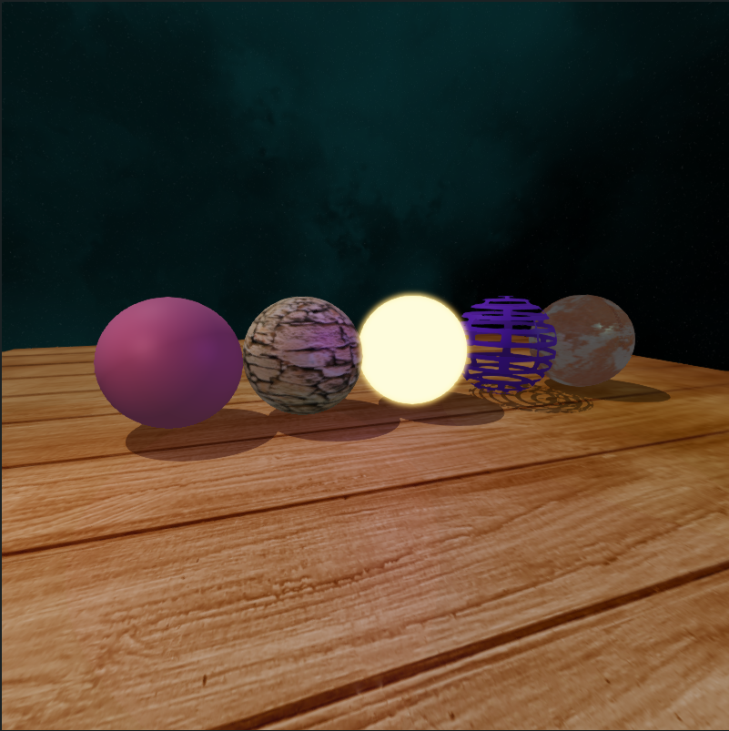
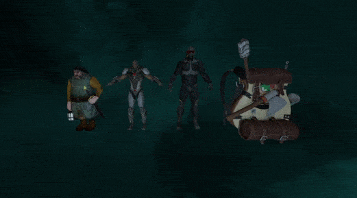
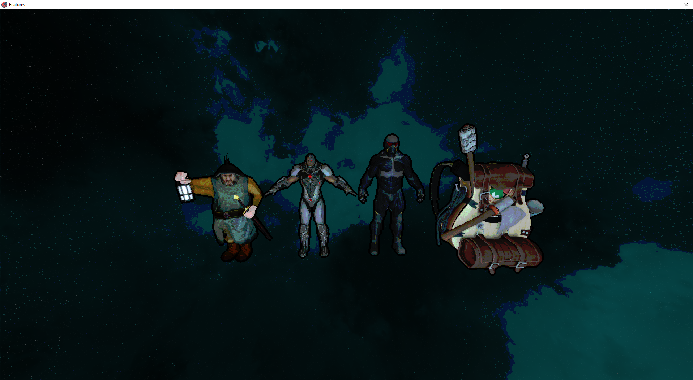
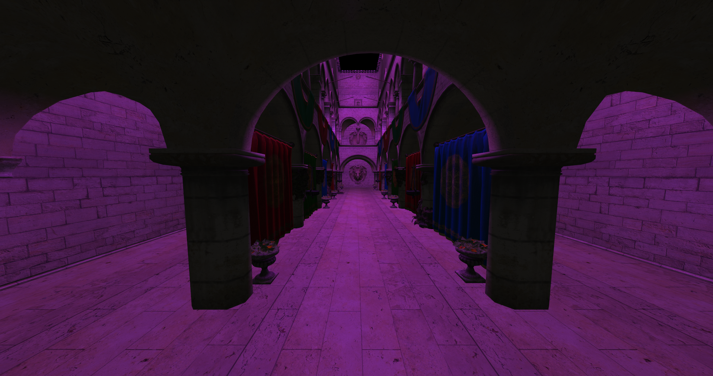

# C++ Graphics Engine

### The project is cross-platform 3D graphics engine, focused on high-performance, low-overhead rendering with modern OpenGL.

- Features:
    - State caching
    - ShaderCompiler + shader program introspection
    - Indexed buffers auto binding
    - Texture unit auto binding
    - Buffer streaming: Orphaning, Unsynchonized, Persistent, Coherent, + fences
    - Immutable storage support
    - Named buffer objects support
    - Bindless textures
    - Persistent/Coherent mapping + TripleBuffering + Explicit Synchronization

- Material System
  - Albedo
  - Specular
  - Normal
  - Emissive color
  - Emissive mask
  - Blend mask
  - Roughness
  - Metalness
  + Blending: Opaque, Translucent, Additive, Modulate
  + Shading type: Lit, Unlit
  + Shading models: Phong, Blinn-Phong
  + Custom materials via shader code
  
  
  
- Dynamic Direct Lighting
- Rigged Model Animations

- Post Processing: HDR, tone mapping, gamma correction, bloom, vignette, tone shading, FXAA

Sponza model

# Dependencies
- glfw3
- glew
- glm
- assimp
- stb_image
