## The project is 3D graphics engine, focused on high-performance, low-overhead rendering with modern OpenGL & C++17.

### Lighting

- Forward/Deferred shading
- Dynamic directional light
- Dynamic point lights
- Dynamic spot lights
- Directional Cascade Shadow maps
- Percentage-Closer Filtering
- Skybox

---

### Material System

Material Properties:
- Сolor
- Albedo texture
- Normal map
- Emissive color
- Emissive mask
- Blend mask
- Refraction
- Ambient occlusion
- Transparency: Translucent, Additive, Modulate
- Shading: Lit, Unlit
- Metallic & roughness workflow
- Material layering
- Custom materials via GLSL snippets that allow you to create whatever material you want
- All properties are run-time changeable

 
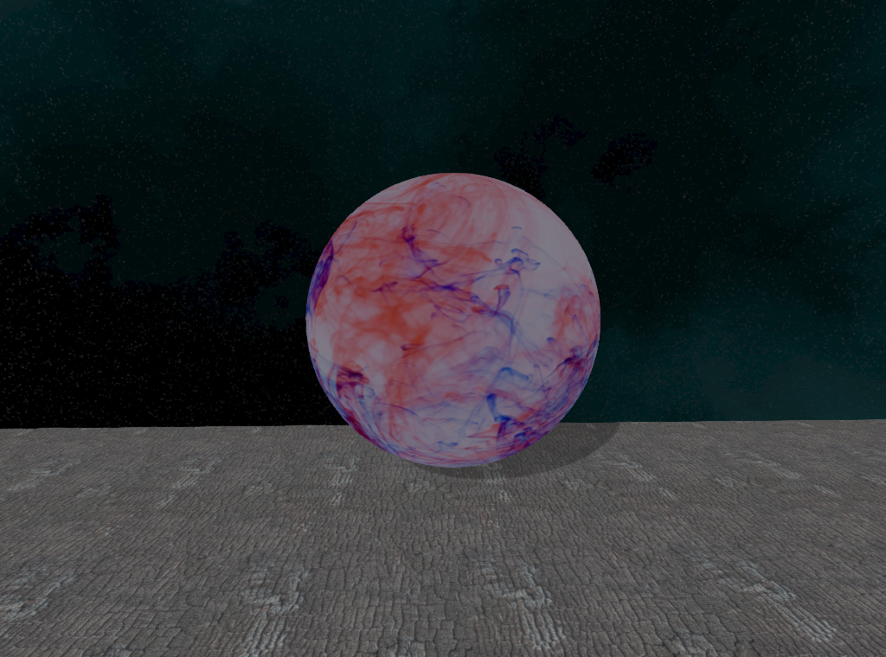
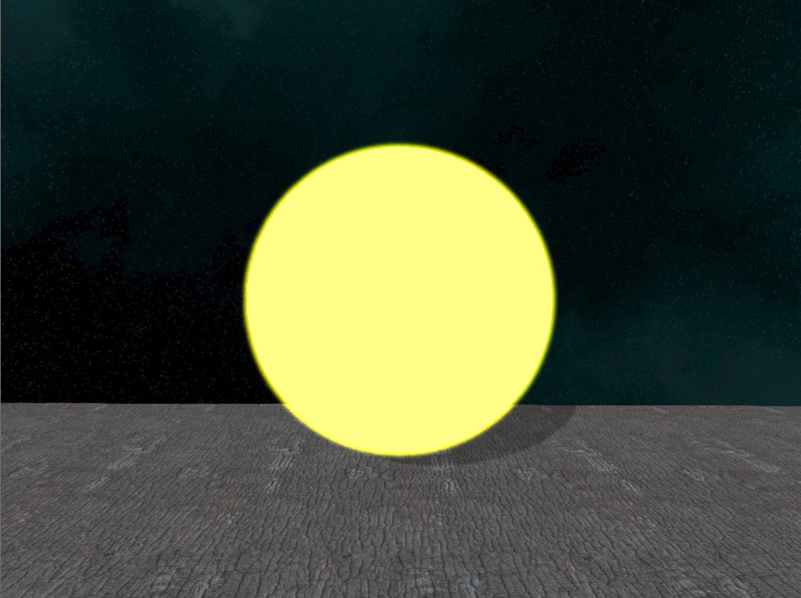
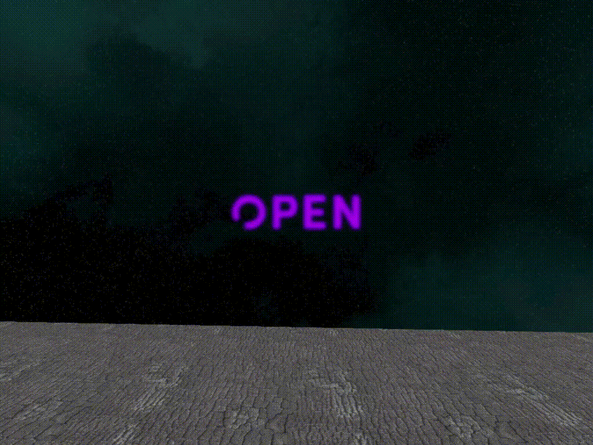

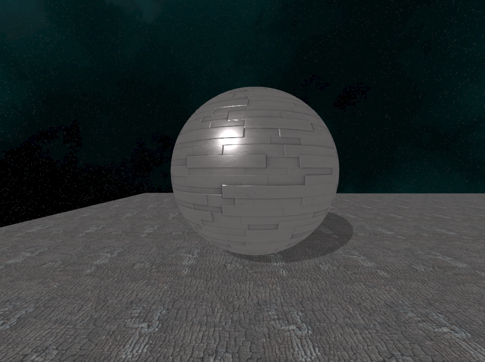
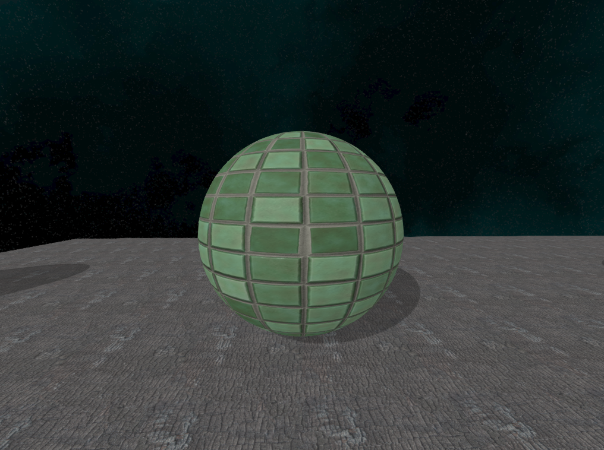

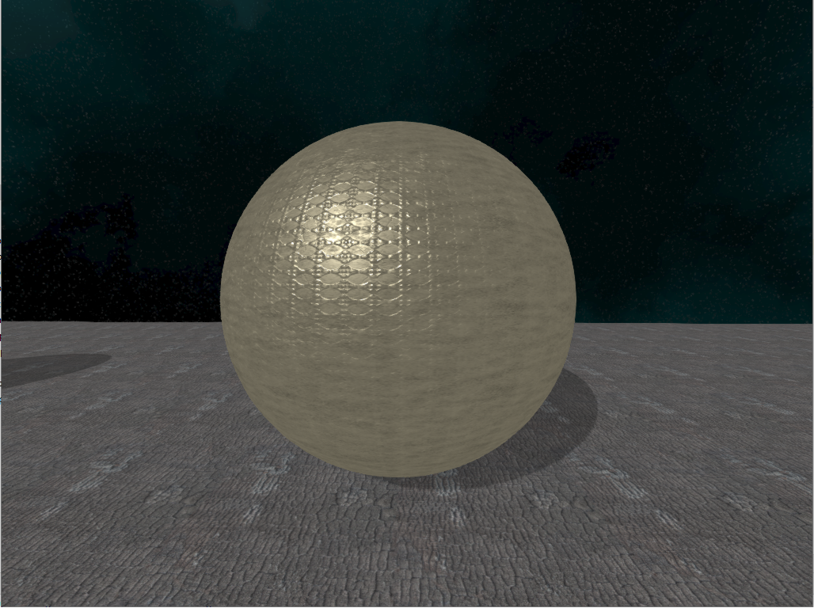
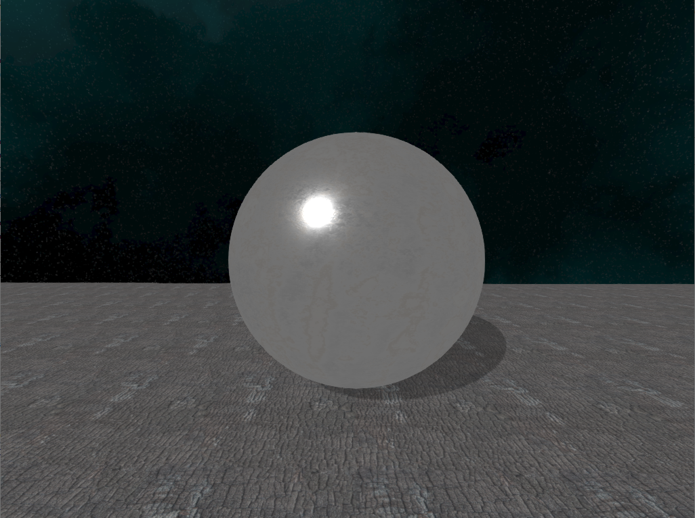

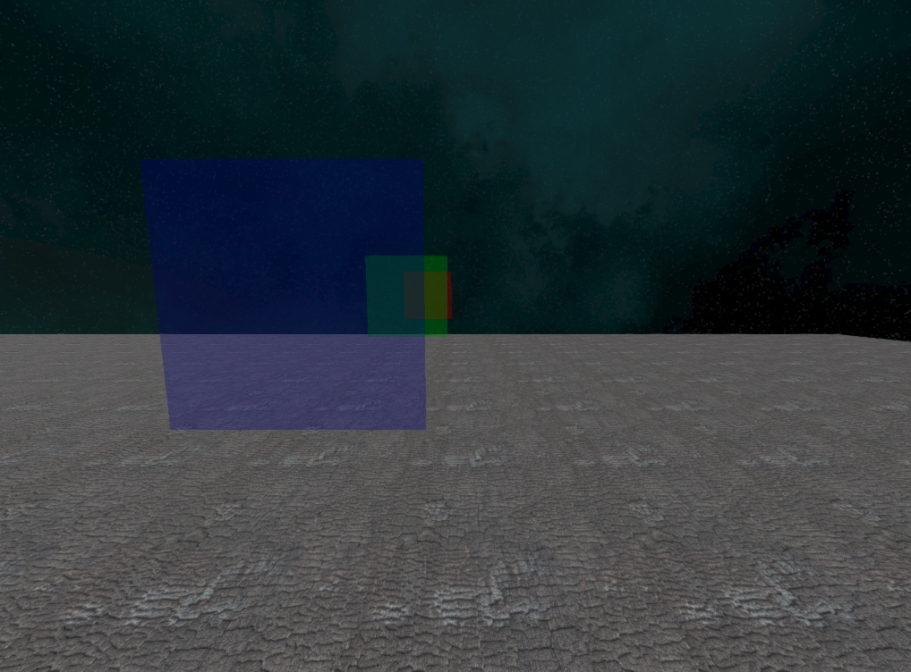

---

### Effect System

- Sprite / Mesh / Beam emitters
- 'initial' & 'by life' modules, const & range value distributions
- Interoperation with material custom properties
- Color, location, velocity, acceleration, size, lifetime, mesh location, mesh attachment, rotation, rotation rate, custom material, beam targets & speed & offset & rebuild & displacement

  
---

### Model Loading

- Model loading using Assimp
- Skeletal models with animations
- Instancing support

---

### Core Features
- OpenGL state caching for reducing driver overhead 
- Multithreaded OpenGL context resource sharing
- ShaderCompiler & ShaderProgram introspection
- Indexed buffers automatic binding to location
- Textures automatic binding to texture units
- Buffer data streaming: Orphaning, Unsynchonized, Persistent, Coherent, TrippleBuffering, Explicit synchronization
- Supports GL_ARB_buffer_storage for immutable buffers
- Supports GL_ARB_texture_storage for immutable textures
- Supports GL_ARB_direct_state_access for VertexArrays, BufferObjects, Textures, etc
- Supports GL_ARB_bindless_texture for bindless textures
- Supports GL_ARB_shader_storage_buffer_object for large blocks in shaders

---

### PostProcessing
  - Tone mapping
  - Gamma correction
  - Bloom
  - Vignette
  - Tone shading
  - FXAA
  - SSAO
---

### Text rendering using FreeType
---

### Content
  
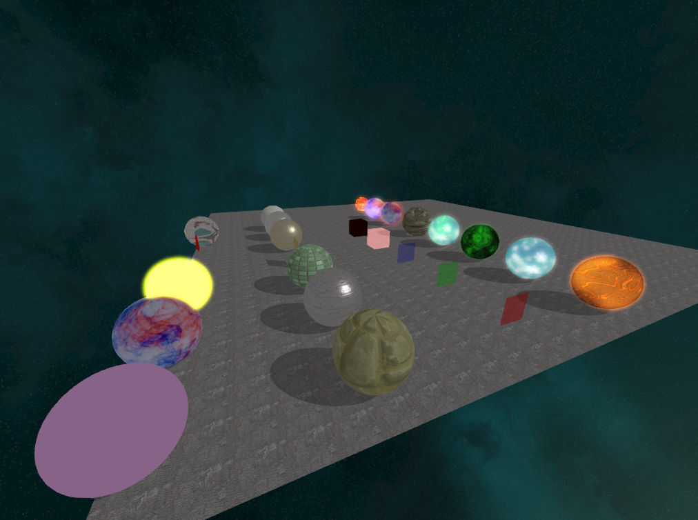

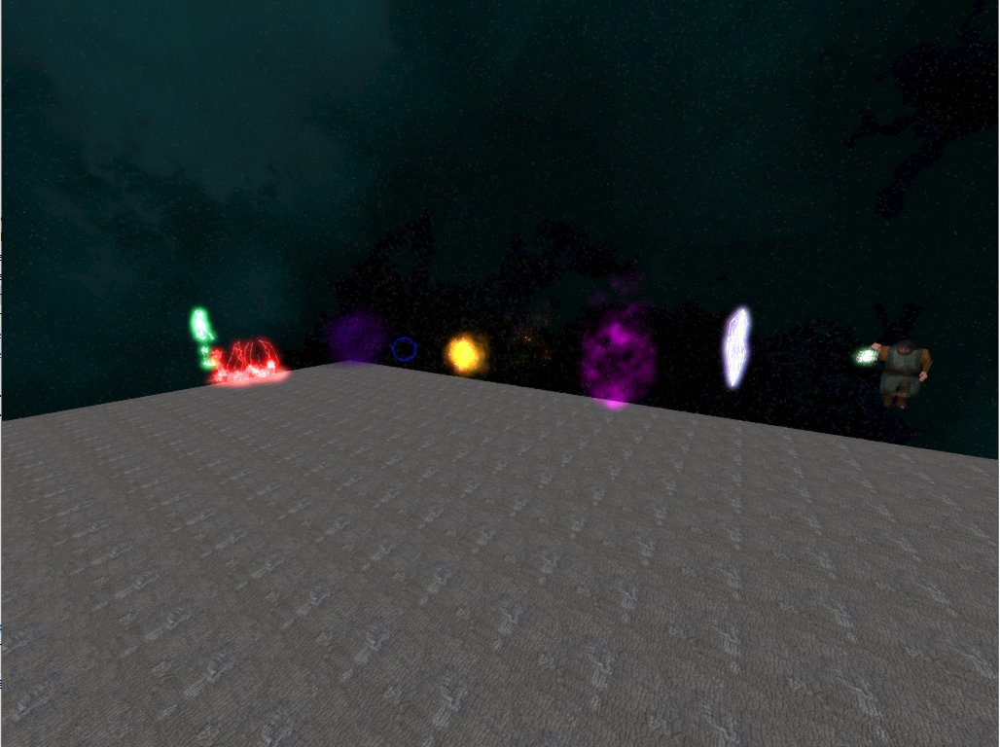

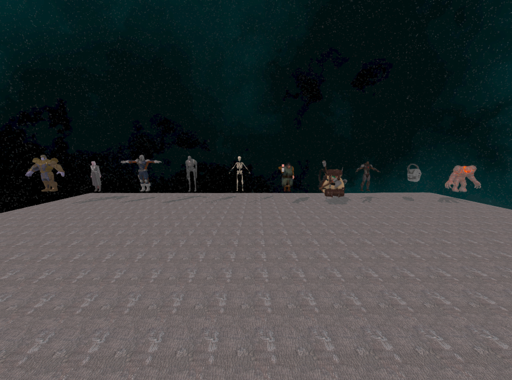

# Build
The project uses C++17 and CMake's find_package for dependencies.

# Dependencies
- glfw3
- glew
- OpenGL
- glm
- assimp
- stb_image
- stb_image_resize
- freetype
