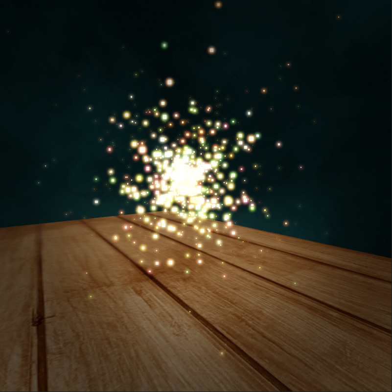
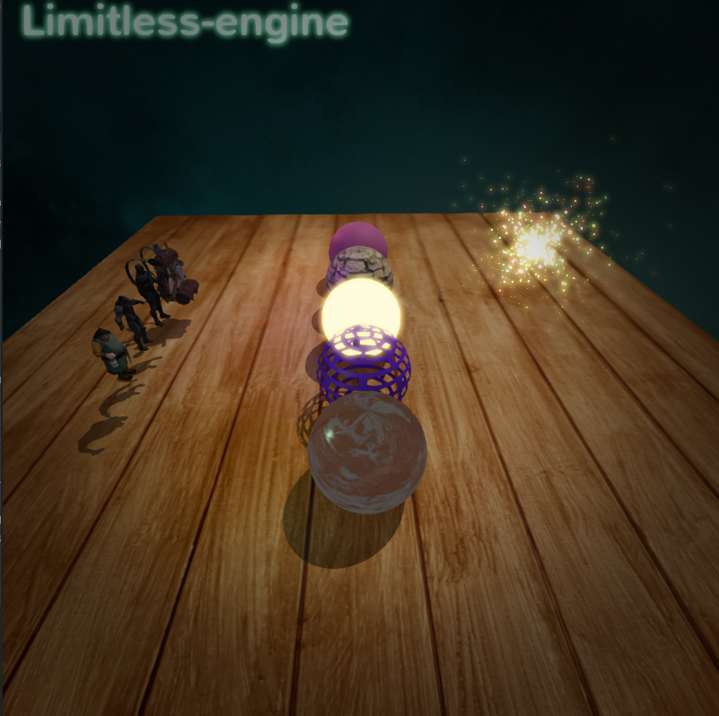
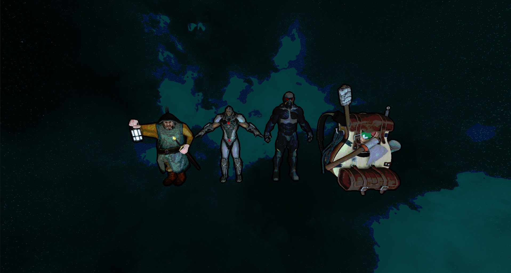

## The project is 3D graphics engine, focused on high-performance, low-overhead rendering with modern OpenGL & C++17.

### Core Features
- OpenGL state caching for reducing driver overhead 
- Multithreaded OpenGL context resource sharing
- ShaderCompiler & ShaderProgram introspection
- Indexed buffers automatic binding to location
- Textures automatic binding to texture units
- Buffer data streaming: Orphaning, Unsynchonized, Persistent, Coherent, TrippleBuffering, Explicit synchronization
- Supports GL_ARB_buffer_storage for immutable buffers
- Supports GL_ARB_texture_storage for immutable textures
- Supports GL_ARB_direct_state_access for VertexArrays, BufferObjects, Textures, etc
- Supports GL_ARB_bindless_texture for bindless textures
- Supports GL_ARB_shader_storage_buffer_object for large blocks in shaders

---

### Material System
  - Ambient color
  - Diffuse texture
  - Specular map and intensity
  - Normal map
  - Emissive color
  - Emissive mask
  - Blend mask
  - Blending: Opaque, Translucent, Additive, Modulate
  - Shading: Lit, Unlit
  - Shading models: Phong, Blinn-Phong
  - Custom materials via GLSL snippets that allow you to create whatever material you want
  
  Physically based rendering:
  
  - Roughness value and map
  - Metalness value and map

---

### Effect System
  - Sprite & Mesh emitters
  - Lots of modules for configure
    
---

### Model Loading & Skeletal animations using Assimp

---

### Lighting 
  - Dynamic Directional light
  - Dynamic Point lights
  - Skybox

---

### Shadows
  - Directional Cascade Shadow Maps
  - Percentage-Closer Filtering

---

### PostProcessing
  - HDR
  - Tone mapping
  - Gamma correction
  - Bloom
  - Vignette
  - Tone shading
  - FXAA

---

### Text rendering using FreeType

---

### Screenshots
  

# Build
The project uses C++17 and CMake's find_package for dependencies.

# Dependencies
- glfw3
- glew
- OpenGL
- glm
- assimp
- stb_image
- stb_image_resize
- freetype
