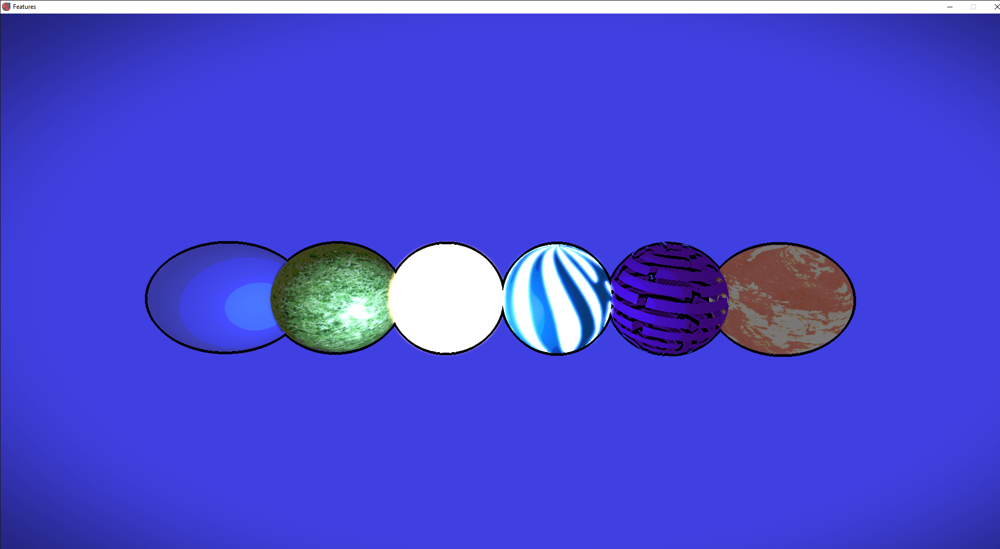

# C++ Graphics Engine

- Material System
  - Albedo
  - Specular
  - Normal
  - Emissive color
  - Emissive mask
  - Blend mask
  - Roughness
  - Metalness
  + Blending: Opaque, Translucent, Additive, Modulate
  + Shading type: Lit, Unlit
  + Shading models: Phong, Blinn-Phong
  + Custom materials via shader code
  
  
  
- Dynamic Direct Lighting
- Rigged Model Animations

- Post Processing: HDR, tone mapping, gamma correction, bloom, vignette, tone shading, FXAA

Sponza model

- OpenGL:
    - State caching
    - Context sharing
    - ShaderCompiler
    - Shader program introspection [ GL_ARB_program_interface_query ]
    - Indexed buffers auto binding
    - Buffer streaming: Orphaning, Unsynchonized, Persistent, Coherent, + fences
    - Immutable storage support [ GL_ARB_buffer_storage/GL_ARB_texture_storage ]
    - Named buffer objects support [  GL_ARB_direct_state_access ]
    - Bindless textures [ GL_ARB_bindless_texture ]
    - Persistent/Coherent mapping + TripleBuffering + Synchronization [ GL_ARB_buffer_storage ]
