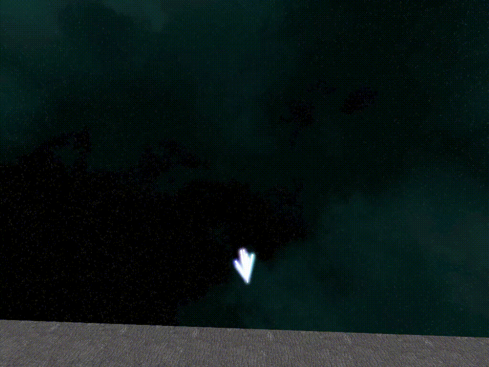
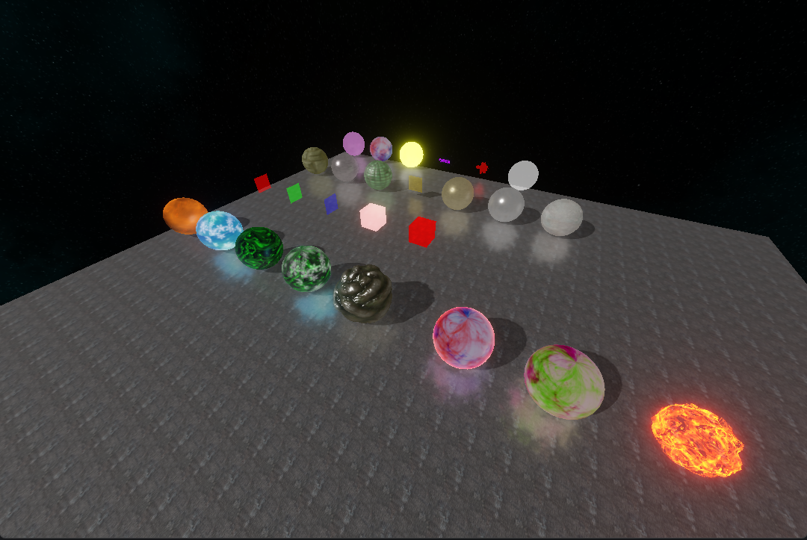
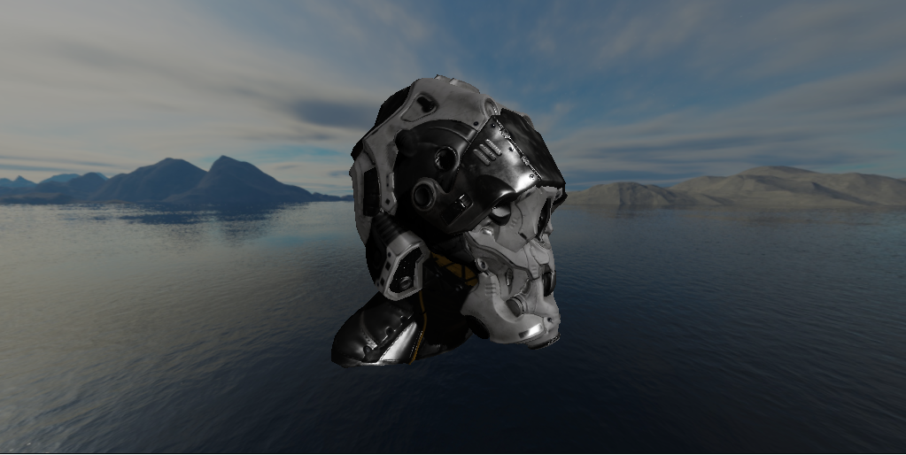
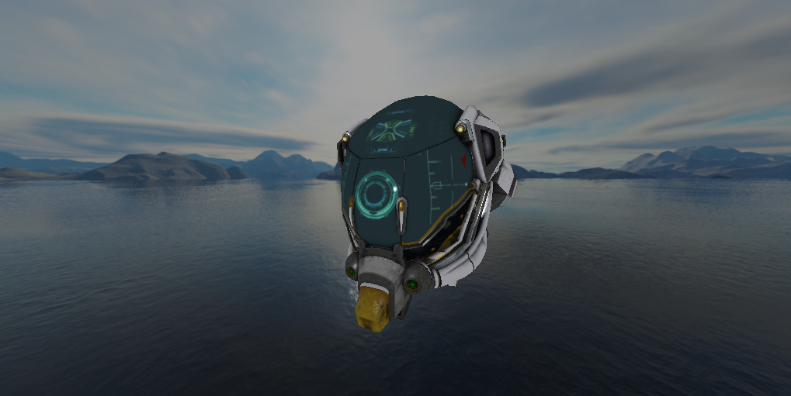
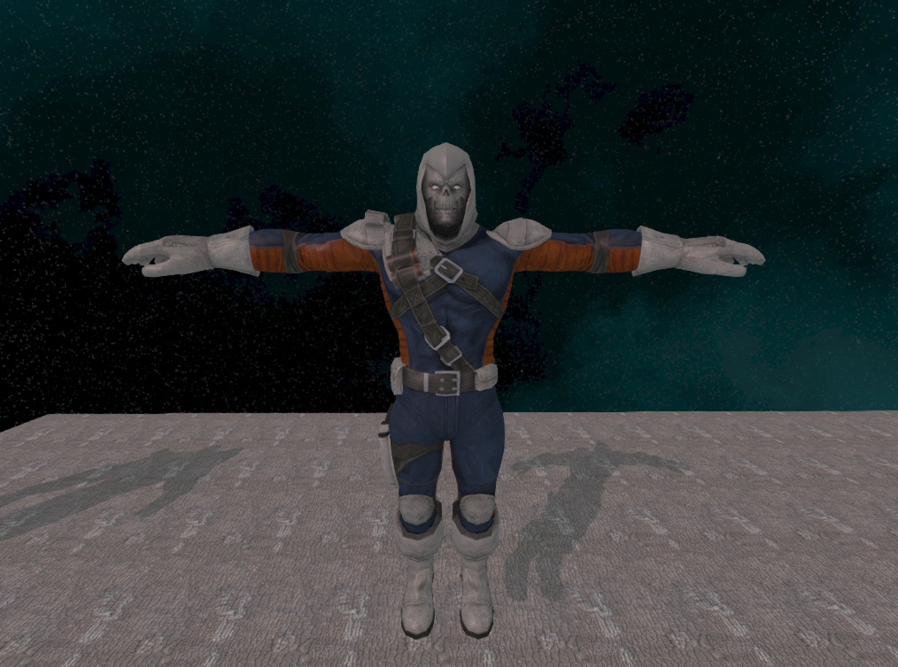
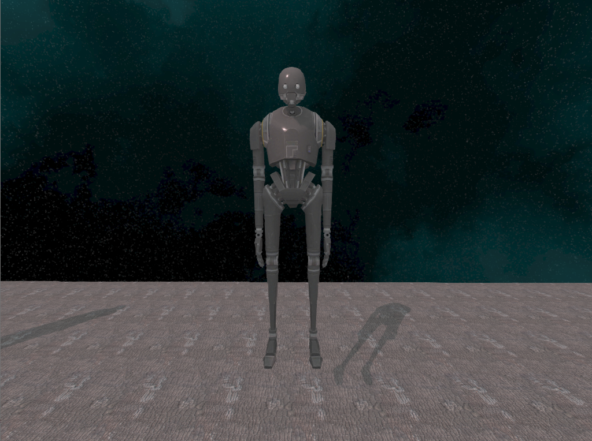
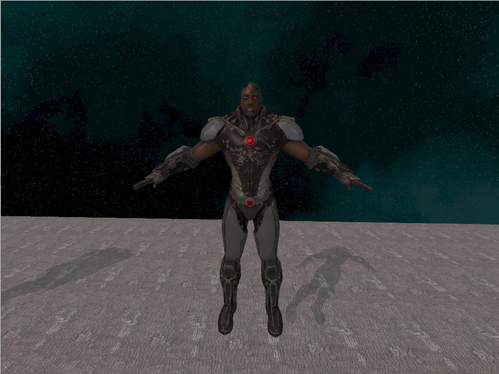
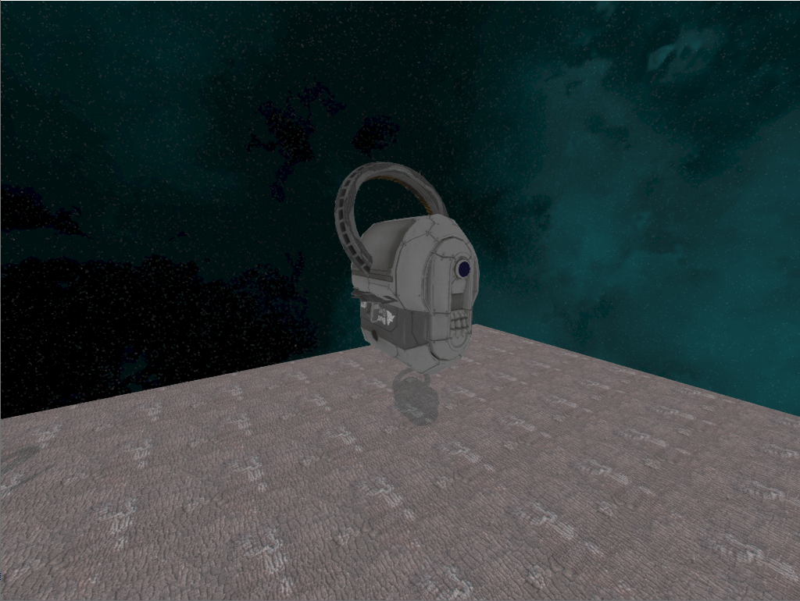

## The project is 3D graphics engine, focused on high-performance, low-overhead rendering with modern OpenGL & C++17.

[](https://github.com/hotstreams/limitless-engine/actions?query=workflow%3ALinux)
[](https://github.com/hotstreams/limitless-engine/actions?query=workflow%3AWindows)

[//]: # ([![MacOS Build Status]&#40;https://github.com/hotstreams/limitless-engine/workflows/MacOS/badge.svg&#41;]&#40;https://github.com/hotstreams/limitless-engine/actions?query=workflow%3AMac&#41;)
[//]: # ([![Web Build Status]&#40;https://github.com/hotstreams/limitless-engine/workflows/Web/badge.svg&#41;]&#40;https://github.com/hotstreams/limitless-engine/actions?query=workflow%3AWeb&#41;)

### Core Features
- OpenGL state caching for reducing driver overhead
- Multithreaded OpenGL context resource sharing
- Shader Compiler & Shader Program introspection
- Indexed buffers automatic binding
- Textures automatic binding
- Texture Compression support
- Time queries
- Buffer data streaming: Orphaning, Unsynchonized, Persistent, Coherent, TrippleBuffering, Explicit synchronization
- Extension support:
    - [x] GL_ARB_buffer_storage
    - [x] GL_ARB_direct_state_access
    - [x] GL_ARB_shader_storage_buffer_object
    - [x] GL_ARB_shading_language_420pack
    - [x] GL_ARB_explicit_uniform_location
    - [x] GL_ARB_tessellation_shader
    - [x] GL_ARB_program_interface_query
    - [x] GL_ARB_texture_storage
    - [x] GL_ARB_bindless_texture
    - [x] GL_EXT_texture_filter_anisotropic
    - [x] GL_EXT_texture_compression_s3tc
    - [x] GL_ARB_texture_compression_bptc
    - [x] GL_ARB_texture_compression_rgtc
---

### Rendering

- Forward & Deferred rendering
- Cook-Torrance microfacet specular BRDF
- Lambertian diffuse BRDF
- Roughness-Metallic workflow
- Translucent materials
- Normal mapping
- Ambient occlusion mapping
- Dynamic directional light, point lights and spot lights
- Directional Cascade Shadow maps
- Percentage-Closer Filtering
- Skybox
- Screen space ambient occlusion
- Screen space reflections
- Screen space refraction
- Tone mapping
- Gamma correction
- HDR Bloom
- FXAA

https://github.com/hotstreams/limitless-engine/assets/37740577/a10e9994-232e-490c-af86-82356a7106fa 

https://github.com/hotstreams/limitless-engine/assets/37740577/7f862e5c-b2ee-4d0f-8d51-4c03b028906a

---

### Material System

- Lit, unlit shading models
- Base color (scalar, texture)
- Metallic (scalar, texture)
- Roughness (scalar, texture)
- Refraction
- Normal
- Emissive color
- Emissive mask
- Blend mask
- Ambient occlusion
- Transparency: Translucent, Additive, Modulate
- Material layering
- Custom materials via GLSL snippets that allow you to create whatever material you want
- All properties are run-time changeable

---

### Effect System

- Sprite, Mesh, Beam emitters
- Initial, By life modules types
- Const, Range value distributions
- Interoperation with material custom properties
- Modules:
    - Color
    - Location
    - Velocity
    - Acceleration
    - Size
    - Lifetime
    - Mesh location
    - Mesh attachment
    - Rotation
    - Rotation rate
    - Custom material
    - Beam targets, speed, offset, rebuild, displacement

<div style="padding: 5px">
    
    
    
    
    
    
    
    
</div>

---

### Examples

<div style="padding: 5px">
    
    
    
    
    
    
    
    
    
    
    
    
    
    
    
    
    
    
    
    
</div>

# Build
This project requires C++17 compiler and CMake.

1) After cloning this Git repo, initialize its Git submodules, which contain 3rd party dependencies and build glew extensions:
```sh
git submodule init
git submodule update
cd thirdparty/glew
make extensions
```

2) Create a new directory for resulting build and start it:
```sh
mkdir build && cd build
cmake ..
make -j12 limitless_demo
./limitless_demo
```

# Dependencies
- glfw3
- glew
- OpenGL
- glm
- assimp
- stb_image
- stb_image_resize
- freetype
